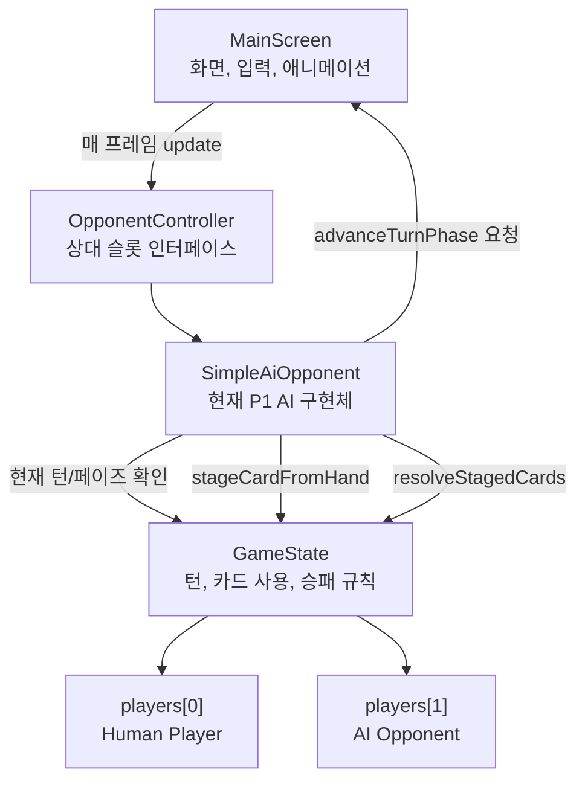

# AI Opponent Controller Structure

## 1차 구조도

## 현재 역할 분리

- `MainScreen`
  - AI를 매 프레임 호출한다.
  - 애니메이션 중에는 AI가 행동하지 못하게 막는다.
  - AI 턴에는 사람 클릭 입력을 무시한다.

- `OpponentController`
  - AI, 네트워크 상대, 로컬 상대 같은 상대 슬롯의 공통 인터페이스다.
  - 화면 전용 기능은 `Actions`로만 받는다.

- `SimpleAiOpponent`
  - 현재는 P1을 조작하는 가장 단순한 AI 구현체다.
  - 드로우/엔드 페이즈는 자동 진행한다.
  - 액션 페이즈에서는 사용 가능한 카드를 점수화해서 스테이징 후 실제 카드 사용 흐름으로 해결한다.
  - 선택형 카드 효과가 발생하면 후보 중 점수가 높은 카드를 선택한다.

- `GameState`
  - 실제 게임 규칙을 처리한다.
  - AI도 사람과 같은 `stageCardFromHand`, `resolveStagedCards`, `advanceTurnPhase` 경로를 사용한다.

## 다음 확장 지점

- `SimpleAiOpponent.evaluateCard()`
  - 카드 효과별 전략 점수를 넣는 곳.

- `OpponentController` 구현체 추가
  - `RemoteOpponentController`를 만들면 네트워크 상대 슬롯으로 확장 가능.
  - `ScriptedOpponentController`를 만들면 발표 녹화용 고정 행동을 만들 수 있음.
